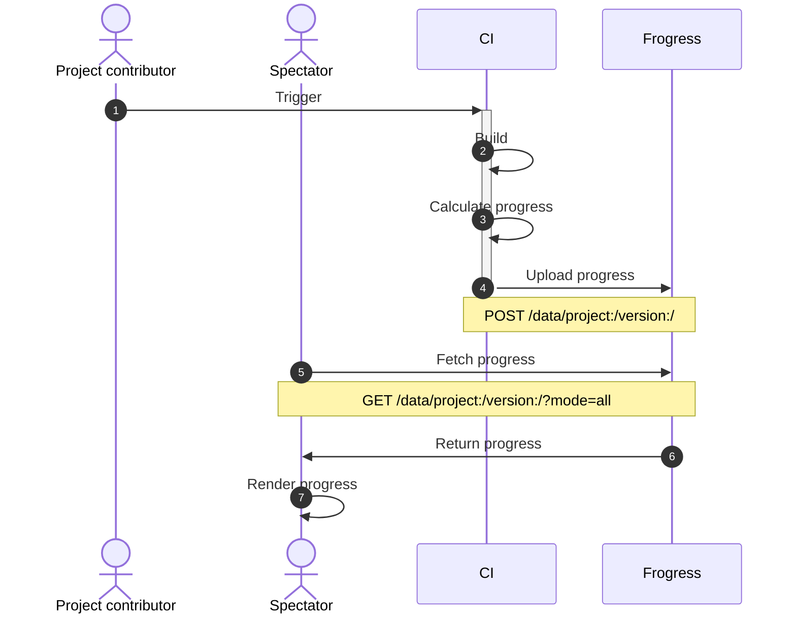

# Guide on how to monitor decomp progress using Frogress

## Overview

It will guide you to onboard your decomp project to Frogress.



*CI: Continuous Integration services including GitHub Actions, Gitlab pipelines, Travis CI and Jenkins.*

## Steps

1. Contact Frogress admin to create project and assign api_key

2. Create schema with `cli.py`

    2.1 Edit `cli.ini`
    
    ```ini
    [frogress]
    domain = https://progress.deco.mp
    api_key = api_key
    ```

    2.2 Create version

    ```bash
    # Usage
    ./cli.py create version -h
    # Example
    ./cli.py create version fireemblem8 us
    ```
    
    2.3 Create category (optional)
    
    Default category: `default`

    ```bash
    # Usage
    ./cli.py create category -h
    # Example
    ./cli.py create category fireemblem8 us default
    ```

3. Upload progress in CI

    3.1 API
    
    ```
    POST https://progress.deco.mp/data/project:/version:/
    ```
    
    ```python
    {
        "api_key": "",
        "entries": [
            "git_hash": "",
            "timestamp": "",
            "categories": {
                "default": {
                    # metrics
                }
            }
        ]
    }
    ```

    3.2 Example
    
    https://github.com/FireEmblemUniverse/fireemblem8u/pull/307

4. Supplement historical data (optional)

    Calculate progress for historical commits and upload it to Frogress if you would like to draw historical curve.

    [Example](https://github.com/laqieer/fireemblem8u/blob/master/.github/workflows/supplement-progress.yml)

5. Prune duplicated data (optional)

    Background: https://github.com/decompals/frogress/issues/27
  
    ```
    # Usage
    ./cli.py prune -h
    # Example
    ./cli.py prune fireemblem8 us
    ```

6. Fetch project data

    6.1 API

    ```
    GET https://progress.deco.mp/data/project:/version:/?mode=all
    ```

    https://progress.deco.mp/data/fireemblem8/us/?mode=all

    6.2 Build a website

    Build a website to render progress graph using a library such as [uPlot](https://github.com/leeoniya/uPlot) and [Chart.js](https://www.chartjs.org).

      - https://pikmin.dev
      - https://axiodl.com
      - https://sotn.xee.dev/
      - https://laqieer.github.io/fe-decomp-portal
      - https://angheloalf.github.io/drmario64
      - https://angheloalf.github.io/puzzleleague64
