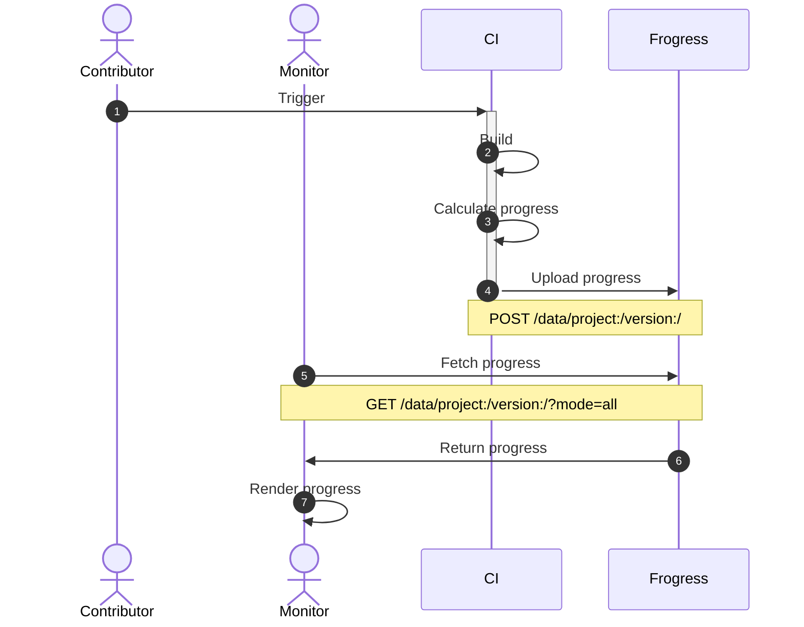

# Guide on how to monitor decomp progress using Frogress

## Overview

### Concepts

- **Contributor**: who submits code to the repo
- **Monitor**: usually a website to show progress
- **CI**: Continuous Integration services including GitHub Actions, Gitlab pipelines, Travis CI and Jenkins
- **Frogress**: this project

### Workflow



## Steps

1. Contact Frogress admin to create a project and assign a key

2. Create schema with `cli.py`

    2.1 Edit `cli.ini`

    2.2 Create version
    
    2.3 Create category (optional)

3. Upload progress in CI

    3.1 API

    3.2 Examples

4. Supplement historical data (optional)

    4.1 Examples

5. Prune duplicated data (optional)

6. Build a website

    6.1 API

    ```
    GET https://progress.deco.mp/data/project:/version:/?mode=all
    ```
    https://progress.deco.mp/data/fireemblem8/us/?mode=all

    6.2 Examples
      - https://laqieer.github.io/fe-decomp-portal
      - https://zelda.deco.mp
      - https://pikmin.dev
      - https://axiodl.com
      - https://angheloalf.github.io/drmario64/
      - https://sotn.xee.dev/
      - https://angheloalf.github.io/puzzleleague64/
